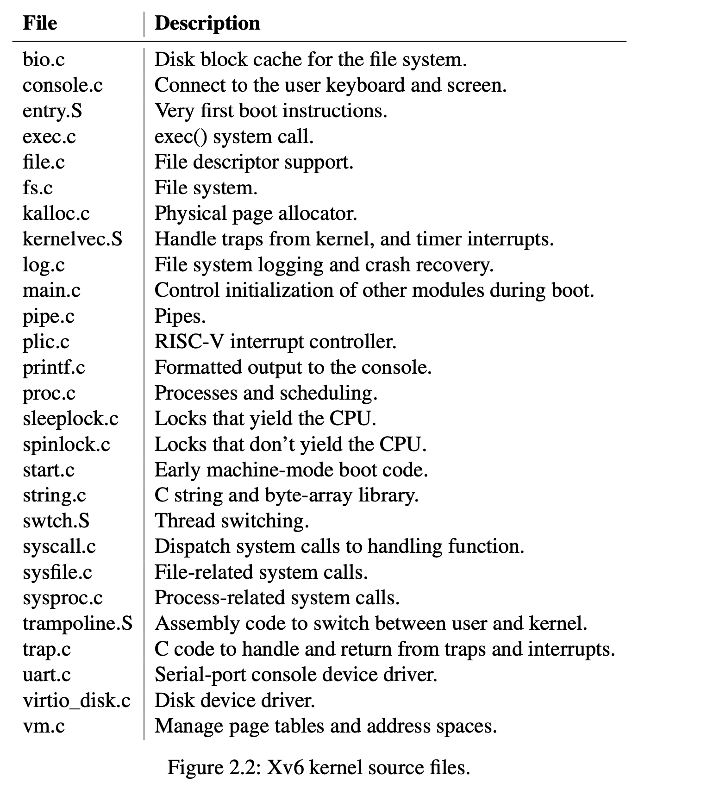

# chapter 2 操作系统的组织
* 操作系统必须满足的三个需求
    * 多路复用
    * 隔离
    * 交互

* 物理资源的抽象
    * 
* 用户模式，监视者模式，系统调用
    * xv6提供 用户模式，监视者模式， 系统模式
        * 系统模式仅在系统启动时使用，之后转换到监视者模式
            * 具有高的权限
        * 监视者模式
            * 监视者模可以执行特权指令，如有效和无效终端，读取和写入寄存器等等
            * 监视者模式下执行的指令也被叫做内核空间。
        * 用户模式
            * 应用程序在用户模式下运行，且无法直接执行内核函数。
                * xv6提供ecall执行内核程序的掉哟哦那个
    * 隔离
        * 
* 内核组织方式
    * monolithic 内核
        * 所有的操作系统在内核下运行，linux就是例子
    * microkernel 内核
        * 通过消息传送的机制，实现应用程序与操作系统之间的调用。

* xv6 代码组织方式
    * 代码文件
        * 

* 进程总览
    * 进程是隔离单元
    * 隔离是通过进程与虚拟内存实现的。
        * 每个进程都有自己独有的页表，页表管理着虚拟内存与物理内存之间的映射关系。
        * 当cpu发送一个虚拟内存地址时，通过页表的翻译将其转换为物理地址
        * 因此每个进程有自己独有的地址空间，并且不会被其他进程所干涉。
    * 进程中保存着重要的上下文数据结构 ， 页表， 内核栈， 用户栈等

* xv6 系统启动过程
