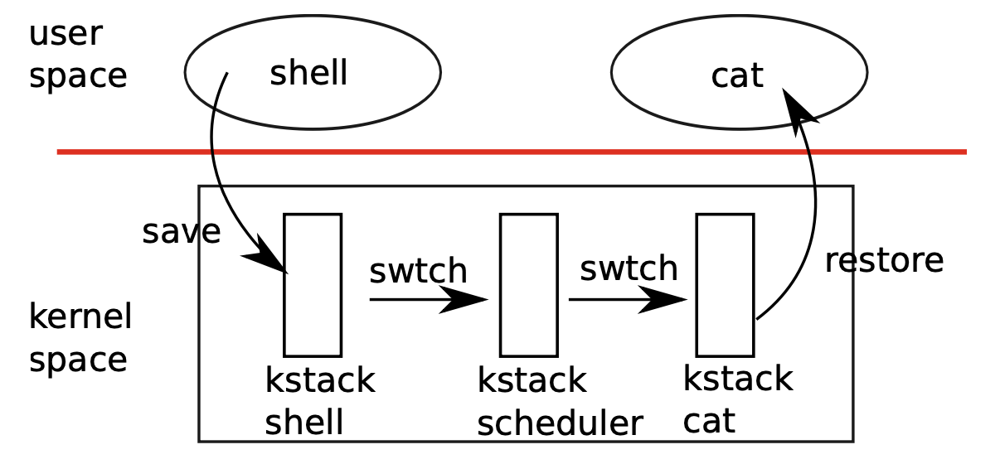

# 第7章 调度
## 7.1 多路复用
* Xv6切换进程的两种方式
    * 第一 当进程在等待I/O或等待子进程时使用sleep与wakeup机制
    * 第二周期性强制切换进程

##  7.2 代码：上下文切换
* 
* 用户进程首先进入到内核当中，如果是CPU的中断信号，则意味着需要让出cpu的执行。
    * 在旧的内核进程中切换到调度的进程的上下文。通过互换调用者寄存器，返回地址寄存器，栈桢寄存器来进入到调度者上下文中。旧的内核进程在互换之前先将自身进程的状态变为可执行。
    * 调度者通过遍历进程表，寻找状态为可执行的进程，将该进程的上下文取得之后，与当前的调度者进程进行互换。
    * 互换成功后，会进入到新的进程的内核中，内核继续执行并切换到新进程的用户进程中。

## 7.3 代码 ： 调度
* 调度中需要使用进程锁，对进程状态，上下文进行保护。

## 7.4 代码：mycpu与myproc
* cpu结构体保存着在当前cpu中运行着的进入到调度者线程的寄存器与自旋锁的嵌套层级。
* 通过tp寄存器的值获得当前正在执行的进程是在哪一个cpu上执行。
* proc结构体指向在当前cpu中运行的进程相关的数据

## 7.5 睡眠与唤醒
* 睡眠与唤醒提供低级别的同步接口。信号量的实现就是一个例子
    * 
    ```
    struct semaphore{
        struct spinlock lock;
        int count;
    }
    // producer
    V (struct semaphore * s)
    {
        acquire(&s->lock);
        s->count++;
        wakeup();
        release(&s->lock);
    }

    // comsumer
    P(struct semaphore * s)
    {
        acquire(&s->lock);
        while(s-> count ==0)
            sleep(s, &s->lock);
        s->count--;
        release(&s->lock);
    }

    ```
    * 通过锁与唤醒睡眠机制，能够实现进程之间的协调。

## 7.6 代码：睡眠与唤醒
* sleep中首先对进程锁进行上锁，用于保护进程状态的更新。并释放代码中原来持有的锁。
* 进程状态更新为sleep，并通过sched调度函数，放弃进程的执行权。

* wakeup函数首先对进程锁进行上锁，用于保存进程状态的更新。
* 遍历进程表，寻找状态为可执行的进程且与参数相同的频道进程，且状态为sleep的进程，将其状态更新为runable（可执行）

* 通过使用锁能够避免唤醒丢失
