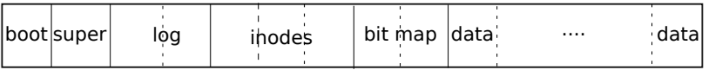
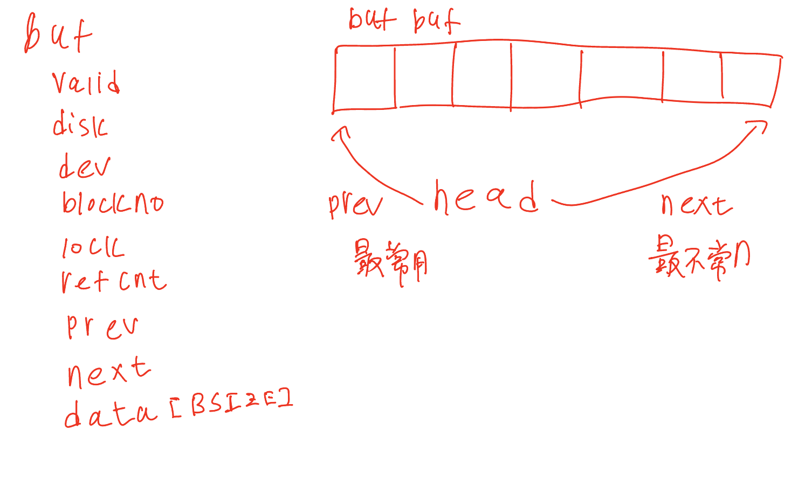

# 第8章
* 8.1 概述
    * xv6文件系统实现分为7层，从上到下，文件描述符（file descriptor），路径名（pathname），目录（directory），索引节点（inode），日志（logging）缓冲区高速缓存（buffer cache），磁盘（disk）。
    * 文件系统的结构
        * 结构
            * 

            * 块1位超级块：包含有关文件系统的元数据（文件系统的大小，数据块大小，日志块大小，索引节点数等）
            * 块2 开始时日志块，用于故障恢复。xv6的日志使用30个块
            * 日志块的后面位索引节点，和位图，数据区域
* 8.2 缓冲区缓存
    * 缓存去缓存的两个任务
        * 同步对磁盘块的访问，确保磁盘块在内存中只有一个副本，并且一次只有一个内核线程使用该副本。
        * 缓存常用块，以便不需要从慢速磁盘中重新读区。
        
* 8.3 代码： Buffer cache
    * 示意图
        * 
    * 代码的实现未做具体详述，课参考[该网页](http://xv6.dgs.zone/tranlate_books/book-riscv-rev1/c8/s3.html)

* 8.4 日志层
    * 