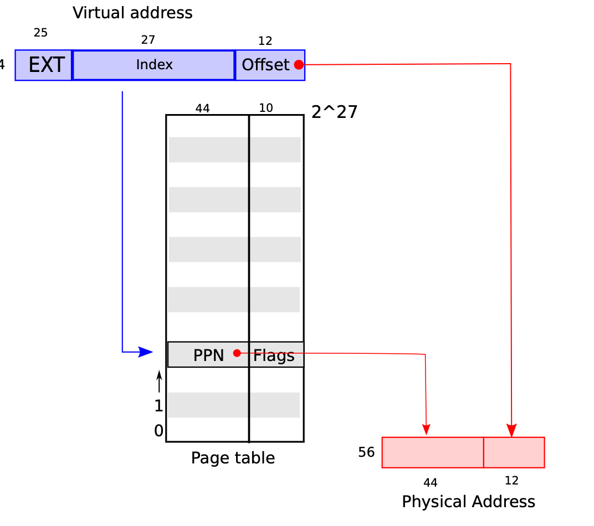

# virtual-memory
* 我们想要隔离地址空间。每个进程有独自的内存，可以读与写自己独有的内存，不可以被其他进程读和写
* 页提供层级的非直接  
    * cpu -> MMU -> RAM  
    *     VA     PA  
    * s/w  仅可通过对虚拟地址load与store，不能对物理地址
    * 内核通知MMU如何映射虚拟地址到物理地址
        * MMU有一个表，由va索引，值为PA，该表被曾为页表 Page Table
        * 
    * MMU被限制用户的代码编程，内核对va->PA的映射由完全的控制权

* RISC-V映射4-kb大小的页，并且对齐。
    * RISV-V在xv6具有64位的地址空间-因此可以使用52位（64-12）作为索引位。
    * 目前52位中的前25位位使用，仅用27位来做索引位

* MMU地址翻译
    * 

* 什么是PTE
    * 每一个pte的大小为64位 目前使用54位
    * 高44位属于物理页的翻号
    * 低10位是pte的flag位
        * flag位说明
        * 

* 页表被保存在哪里
    * 在内存中-- MMU

* RISC-v使用3级页表来存储空间
    * 
    * 页目录
        * 页目录有512个页表条目（PTE）
        * 页表条目指向下一级的页目录
        * 一共可以有512*512*512 个页表条目
    * 页目录可以是无效的
        * 
* MMU如何知道页表在内存的哪里？
    * satp 寄存器保存着根页表的物理地址
    * 页可以在内存中的任何位置-不需要一定是连续的
    * 当切换到其他地址空间或应用时satp会被重写

* RISC-V如何翻译虚拟地址
    * 需要找的正确的PTE
    * satp寄存器指向根的PTE
    * 虚拟页表的索引位的前9位为索引在根页表中寻找下一级的页表的物理地址
    * 虚拟页表的索引位中间9位为索引在下一级中寻找下下一级物理地址
    * 虚拟页表的索引位后9位为索引在第二级中找到的物理地址寻找想要访问的物理页番号
    * 物理页号 = PTE + 虚拟地址的低12位号

* 如果V（有效位）没有被赋值，或者存储store和W（写入位）没有被赋值
    * 缺页
    * 强制转换到内核模式
        * trap.c 
    * 内核可以产生错误，并终止进程 

* 为什么在内核中使用虚拟内存
    * 对于内核在硬件层面上关闭虚拟内存比较困难
    * 内核使用虚拟内存也有收益
        * 

## 虚拟内存在xv6中的
* 内核页表
    * 
    * 简单映射虚拟内存与物理内存
    * 双倍映射trampoline
    * 注意权限
    * 为何映射设备

* 每个进程有自己的地址空间和自己的页表
    * 
        * trampoline与trapframe是不可以被用户进程写入
    * 

## 集合重要的函数
* kvmmap 通过参数中的页表，va，pa构建虚拟地址与物理地址的映射
    * 调用mappage函数来实现
* kvminithart（）
    * 对寄存器stap设置根页表的物理地址

* mappages 
    * 给定一个根页表，虚拟地址，物理地址，大小，与权限执行va与pa的映射操作。

* walk 
    * 给定根页表，虚拟地址与分配flag，取得最低一级的页表。如果下一级的页表有效位未设定，则生成页大小（4kb）的空间并分配给页表中。

* procinit
    * 给进程分配内核栈与保护页

    